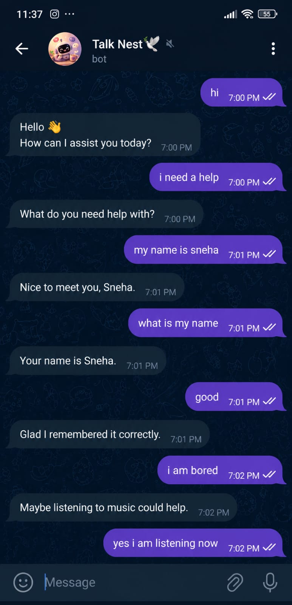
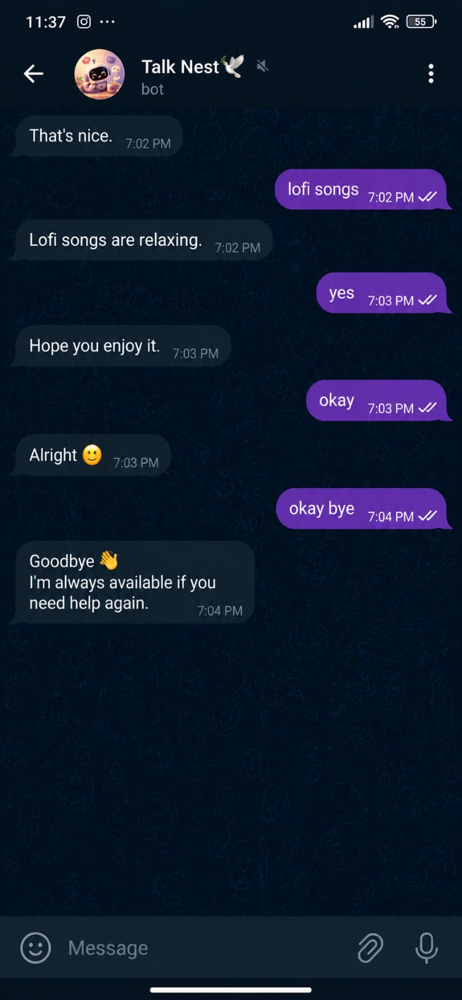

# 🤖 Telegram AI Chat Bot (Python Experimental Project)

A Python-based Telegram chatbot developed as an **experimental learning project** to explore automation, REST API integration, and basic AI-driven response generation.

The bot receives messages from users, processes them using a custom AI logic engine, and sends automated replies in real time using the Telegram Bot API. This project demonstrates how real-world chatbot systems work using lightweight Python scripting.

---

# 📸 Chatbot Preview

<table>
  <tr>
    <td align="center">
      <br>
      <b>Chat Example 1</b>
    </td>
    <td align="center">
      <br>
      <b>Chat Example 2</b>
    </td>
  </tr>
</table>

---

# 🚀 Features

- 🤖 AI-based automated responses  
- 💬 Real-time Telegram messaging  
- ⚡ Continuous polling system for updates  
- 🌐 Telegram Bot API integration  
- 🧠 Custom AI response engine  
- 📩 Instant automated replies  
- 🪶 Lightweight Python-based implementation  

---

# 🧠 How It Works

1. User sends a message on Telegram  
2. Bot receives updates via Telegram Bot API  
3. Python script continuously checks new messages (polling)  
4. Message is processed by the AI engine  
5. Response is generated dynamically  
6. Bot sends the reply back instantly  

---

# 🛠 Technologies Used

- Python  
- Telegram Bot API  
- requests library  
- JSON handling  
- REST API concepts  

---

# 📂 Project Structure

```bash
Telegram-Chat-Bot/
│
├── bot.py
├── aiengine.py
├── requirements.txt
└── README.md

```
# 📊 Advantages

- ⚡ Lightweight and easy to run
- 🤖 Automates chat responses without human involvement
- 🔌 Simple REST API integration using Telegram Bot API
- 🧠 Easy to customize and extend AI logic
- 📚 Excellent beginner-friendly Python project
- 💬 Demonstrates real-time communication handling


# Future Scope

- 🧠 Integration with advanced NLP/AI models for smarter responses
- 🌐 Migration from polling to webhook-based architecture
- 💾 Database integration for chat history and analytics
- 🔊 Voice message processing and audio replies
- 🌍 Multi-language support for global users
- 📊 Admin dashboard for monitoring bot performance
- 🔁 Context-aware conversational AI system
